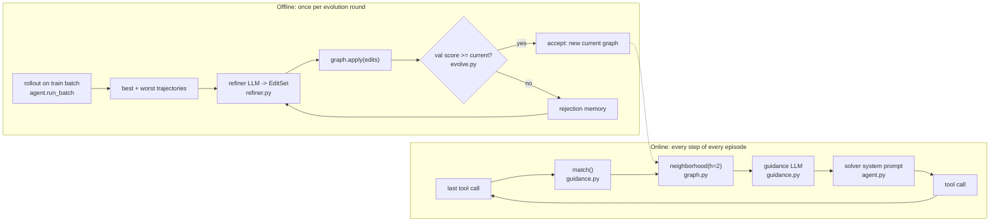

# Procedural Graphs Deep Dive

*Giving an LLM agent an explicit, editable map of "how this kind of task is done" — injecting the relevant corner of that map into its prompt at every step, and letting a second LLM redraw the map from the agent's own successes and failures.*

Agents get better at a task the way people do: by accumulating procedure. *Search for the specific entity, not the whole question. Raise money before the surge, not during it. Don't resubmit while a request is pending.* Today that knowledge lives in one of two places — a system prompt that grows until nobody dares edit it, or model weights you can't inspect. Neither is something you can diff, review, or roll back.

**Procedural Graphs** ([arXiv 2609.09153](https://arxiv.org/abs/2609.09153)) proposes a third home: a small graph whose nodes are procedures (tool calls, reasoning steps, task states) and whose edges say *when* to move from one to the next, *how*, and *what to avoid*. The method has two halves:

- **Online guidance** — at every step, find where the agent is in the graph, cut out the neighborhood around that spot, and have an LLM turn it into two or three sentences of advice for the very next move.
- **Offline self-evolution** — run the agent on a batch of tasks, show a stronger "refiner" LLM the best and worst attempts, let it propose edits to the graph, and keep the edits only if a held-out validation set says they helped.

This repo is a deliberately small reference implementation of both halves on LangGraph — about 2,000 lines, no framework. In this walkthrough we'll follow one real question through the system, look at the actual text each LLM saw, and find the code that produced it. Everything quoted below (graphs, guidance, logs, prompts) comes from real runs of this codebase.

## The conceptual map: who does what, and who checks whom

Before any code, here is the whole method on one page. Every later section is one row of this table seen up close.

| Role | What it is | What it sees | What it produces | Who checks it |
|---|---|---|---|---|
| **Solver** | the agent being improved (a small LLM with tools) | task, its own history, this turn's guidance | tool calls | the environment's score |
| **Guidance model** | the same small LLM, called once per step | task, last 3 steps, the graph neighborhood around the last tool call | 2–5 sentences of advice, discarded after one turn | nothing directly — only through the solver's score |
| **Graph** | a JSON file: procedures as nodes; condition / guidance / pitfalls on edges | – | the only thing that persists and improves | the validation gate, then a person reading it |
| **Refiner** | a stronger LLM, called once per round | environment description, tools, the whole graph, the 3 best and 3 worst trajectories, rejection memory | a typed `EditSet` (add/delete nodes and edges) plus a rationale | the validation gate |
| **Validation gate** | plain code, no LLM | the candidate graph's score on a fixed held-out split | accept (score ≥ current) or reject → rejection memory | the untouched test split, with controls |

**How a graph is developed.** It starts as a *skeleton* — `Start`, `End`, one node per tool, no edges — or as a hand-written expert graph. Then, per round: (1) run the agent on a train batch **with the current graph**; (2) rank the trajectories and hand the refiner the best and worst, because contrast is the signal; (3) the refiner returns edits as data, never a rewritten graph; (4) the edits are applied to a **copy**; (5) the copy is run on the validation split with the full online machinery; (6) it replaces the current graph only if it scores at least as well. A rejected proposal is summarised into the refiner's next prompt so it is not tried again.

**How it is maintained.** The graph is an ordinary versioned file. Every round writes the graph it kept, the edits it proposed (accepted or not), the refiner's exact prompt, its rationale, and every trajectory — so any edge can be traced to the round, the evidence and the score that put it there, and any round can be rolled back by pointing `--init` at an earlier file. You can also edit the JSON by hand and evaluate your version against the original.

**Supervision — and how the supervisor is evaluated.** There is no human in the loop and no LLM judge. The refiner is the only thing that "supervises" the agent, and the design's central move is that **the refiner is never trusted**: its proposals are hypotheses, and the only test is behavioural — does an agent guided by the edited graph score better on tasks the refiner never saw? That is the whole evaluation of the supervisor, and it is per proposal. Three consequences worth knowing up front:

- *The rationale is never verified.* A proposal can be accepted for reasons unrelated to the story the refiner tells about it. The rationale is documentation for the human reader, not evidence.
- *The gate is itself noisy.* One validation pass is one sample of a stochastic agent, and "keep the best of several candidates" biases the kept score upward. So validation scores cannot be the final word; the gate is in turn checked by a **test split the loop never touches**, compared pairwise against no graph, against the edgeless skeleton (which isolates "the graph's content helps" from "an extra LLM call per step helps"), and against the expert graph.
- *The guidance model is never evaluated alone.* It is judged only through the solver's outcomes, which is why the skeleton control matters.

Human oversight therefore lives *outside* the loop, in the artifacts: the per-round diff and timeline (`analysis/graph_evolution.py`), the saved refiner prompts, and the paired test-split statistics (`analysis/paired_comparison.py`).

The rest of this walkthrough takes these in mechanical order: the graph data structure, the solver loop, the guidance loop that injects the graph, the evolution loop that edits it, and the evaluation that decides whether any of it helped.

## The map of the repo

```
src/pg/
  graph.py        the data structure: Node / Edge / EditSet / ProceduralGraph (neighborhood, serialize, apply)
  guidance.py     ONLINE half: localize -> neighborhood -> guidance LLM
  agent.py        the solver loop (LangGraph StateGraph); where guidance enters the prompt
  refiner.py      OFFLINE half, part 1: the refiner prompt and the structured EditSet reply
  evolve.py       OFFLINE half, part 2: rollout -> refine -> validate -> accept/reject + rejection memory
  evaluate.py     run a split under several graphs, side by side
  trajectory.py   Step / Trajectory records, summaries, per-episode rows
  llm.py          the only place an LLM client is built (OpenRouter), plus token/cost accounting
  tracking.py     optional Weights & Biases logging
  cli.py          `pg gen-data | evolve | eval`
  envs/
    base.py             the ONLY interface a scenario implements: Environment + Episode
    hotpotqa/           multi-hop QA: short episodes, cheap to iterate on
    finance/            synthetic 24-month startup simulator
    enterprisearena/    adapter over the EnterpriseArena CFO benchmark (132-month episodes)
graphs/           hand-written "expert" graphs; evolved graphs land in graphs/evolved/
analysis/         not needed to run anything: paired statistics over eval runs, graph-evolution diff / Mermaid /
                  timeline, this walkthrough
```

The rule that keeps this readable: **nothing outside `envs/` knows what task it is solving.** `graph`, `guidance`, `agent`, `refiner` and `evolve` only ever see tool names, text observations and a score.

Here is how the pieces connect:



### Setup

```bash
uv sync                      # fetches Python 3.13
cp .env.example .env         # set OPENROUTER_API_KEY
uv run pytest                # unit tests, no network
uv run pg gen-data hotpotqa --seed 0 --n 300
```

Every LLM call goes through OpenRouter via one function, `make_llm` in [`llm.py`](../src/pg/llm.py). By default the solver and the guidance model are the same small model (`openai/gpt-5.6-luna`), as in the paper, and the refiner is a stronger one (`anthropic/claude-opus-5`). I use W&B for metrics; more on that near the end.

Let's start with the thing itself.

## What a procedural graph looks like

Open [`graphs/hotpotqa_expert.json`](../graphs/hotpotqa_expert.json), a hand-written graph for multi-hop question answering. A few of its nodes and one of its edges:

```json
{
  "name": "hotpotqa_expert",
  "nodes": [
    {"id": "Start",   "type": "STATE",     "description": "A multi-hop question has been posed."},
    {"id": "search",  "type": "ACTION",    "description": "Keyword search over the context paragraphs."},
    {"id": "analyze", "type": "REASONING", "description": "Extract the bridge entity or the facts found so far and decide what the second hop needs."},
    {"id": "finish",  "type": "ACTION",    "description": "Submit a short answer span."}
  ],
  "edges": [
    {"src": "analyze", "rel": "LEADS_TO", "dst": "search",
     "condition": "A bridge entity or second comparison entity is identified but its paragraph has not been retrieved.",
     "guidance":  "Second hop: search for the bridge entity by name together with the attribute the question asks about.",
     "pitfalls":  "Do not stop after one hop; most HotpotQA questions need two paragraphs."}
  ]
}
```

Three node types, and every edge carries three pieces of free text: a **condition** (when does this transition apply), **guidance** (how to do it) and **pitfalls** (what goes wrong). That's the whole knowledge representation. The schema in [`graph.py`](../src/pg/graph.py) is a direct transcription:

```python
class NodeType(str, Enum):
    ACTION = "ACTION"  # a tool call
    REASONING = "REASONING"  # an internal reasoning step
    STATE = "STATE"  # a task status such as Start / End

class Relation(str, Enum):
    LEADS_TO = "LEADS_TO"
    TRIGGERS = "TRIGGERS"
    PROVIDES_INPUT_FOR = "PROVIDES_INPUT_FOR"
    CONVERGES_TO = "CONVERGES_TO"

class Node(BaseModel):
    id: str = Field(description="Unique node id. For ACTION nodes this must equal the tool name.")
    type: NodeType = NodeType.ACTION
    description: str = ""

class Edge(EdgeRef):  # EdgeRef = (src, rel, dst)
    condition: str = Field(default="", description="When this transition applies.")
    guidance: str = Field(default="", description="How to proceed along this transition.")
    pitfalls: str = Field(default="", description="What to avoid on this transition.")
```

One line in there does a lot of work: **an ACTION node's id must equal a tool name.** That convention is the entire localization mechanism — if the agent's last tool call was `search`, the agent is "at" the node called `search`. No embeddings, no classifier. A test ([`tests/test_expert_graphs.py`](../tests/test_expert_graphs.py)) checks every hand-written graph against the real tool lists so a typo can't silently break it.

Because the models are pydantic, the same classes serve three purposes: the JSON file format (`load` / `save`), the refiner's structured-output schema (the `Field` descriptions above are read by the refiner LLM), and the in-memory structure.

## An agent without a graph

Before adding guidance, let's see the plain agent. A scenario plugs in through two small classes in [`envs/base.py`](../src/pg/envs/base.py):

```python
class Episode(ABC):
    """Per-episode state. One instance per (task, rollout); tools close over it, so
    concurrent episodes never share state."""
    tools: list[BaseTool]

    @abstractmethod
    def is_done(self) -> bool: ...

    @abstractmethod
    def score(self) -> dict:
        """Must contain 'score' (float, higher is better) and 'success' (bool)."""

class Environment(ABC):
    name: str
    description: str  # one paragraph for the refiner
    max_steps: int  # tool calls per episode

    def tasks(self, split: str) -> list[Task]: ...
    def start(self, task: Task) -> Episode: ...
    def system_prompt(self) -> str: ...
```

`Environment` is shared and read-only; `env.start(task)` hands back a fresh `Episode` that owns all mutable state. That split is what makes it safe to run episodes in a thread pool.

HotpotQA's episode ([`envs/hotpotqa/`](../src/pg/envs/hotpotqa/)) gives the agent three tools over the question's own ten paragraphs — `search(query)` (top 3 by word overlap), `lookup(title)`, `finish(answer)` — eight steps, and scores the answer with SQuAD-style F1.

The loop that drives any episode is a four-node LangGraph `StateGraph` in [`agent.py`](../src/pg/agent.py):

```
START -> guide -> solver -> tools -> guide ...   (tool call)
                  solver -> text  -> guide ...   (text-only reply; nudge, or accept as final)
```

```python
builder = StateGraph(AgentState)
builder.add_node("guide", guide)
builder.add_node("solver", solve)
builder.add_node("tools", act)
builder.add_node("text", text)
builder.add_edge(START, "guide")
builder.add_edge("guide", "solver")
builder.add_conditional_edges("solver", after_solver, ["tools", "text"])
builder.add_conditional_edges("tools", continue_or_end, ["guide", END])
builder.add_conditional_edges("text", continue_or_end, ["guide", END])
```

The `tools` node is hand-written rather than LangGraph's `ToolNode`, because the important by-product of acting is the **record**: every call becomes a `Step(index, tool, args, observation)`. Those steps are what the guidance model reads (the last three), what the refiner reads (all of them), and what gets saved. Tool errors are caught and shown to the solver as an observation rather than raised:

```python
try:
    obs = str(tools[call["name"]].invoke(call["args"]))
except Exception as e:  # bad arguments etc. are shown to the solver, not raised
    obs = f"Error: {e}"
steps.append(Step(index=len(steps), tool=call["name"], args=call["args"], observation=obs[: cfg.observation_max_chars]))
```

When `graph is None`, the `guide` node returns `{}` and this is an ordinary tool-calling agent. That's our baseline — the "none" condition in every comparison later.

## Injecting the graph: one question, step by step

Now let's run with the expert graph and watch a real test question go through:

> **Question:** How many times has the author of *Negotiating with the Dead* been shortlisted for the Booker Prize?  *(gold: "five times")*

This is a classic two-hop question: first find the author, then find the fact about the author.

### Step 0 — not localized yet

No tool has been called, so there is no "current node". The guidance model is shown the **whole** graph and writes:

> Begin with the **search** action using the distinctive title phrase **"Negotiating with the Dead"**; do not answer from memory before retrieving evidence.

Compare that with the `Start → search` edge in the JSON: *"search with the most specific named entity or distinctive phrase from the question, not the whole question"* / *"Do not answer from memory before retrieving evidence."* The guidance model has done exactly one job: **instantiate a generic edge for this specific question.** The solver obliges:

```
STEP 0: search({"query": "Negotiating with the Dead"})
  -> [Negotiating with the Dead] Negotiating with the Dead: A Writer on Writing is a non-fiction
     work by Canadian author Margaret Atwood. Cambridge University Press first published it in 2002.
```

### Step 1 — localized at `search`

Now there is a last tool call, and this is where the three online mechanisms fire in sequence. All of it is in [`guidance.py`](../src/pg/guidance.py), which is 43 lines:

```python
def match(graph: ProceduralGraph, last_tool: str | None) -> str | None:
    """Exact match of the last tool call to a node id; None means 'not localized' (use the full graph)."""
    return last_tool if last_tool and graph.has_node(last_tool) else None

def build_context(graph: ProceduralGraph, task_text: str, recent_steps: list[Step], h: int) -> str:
    active = match(graph, recent_steps[-1].tool if recent_steps else None)
    sub = graph.neighborhood(active, h) if active else graph
    steps = "\n".join(f"{s.index}. {s.tool}({json.dumps(s.args)}) -> {s.observation}" for s in recent_steps)
    return f"Task:\n{task_text}\n\nRecent steps:\n{steps or '(none yet)'}\n\n{sub.serialize(active)}"
```

**1. Localize.** `match` is the one-liner promised earlier: last tool name → node id.

**2. Cut out the neighborhood.** `neighborhood(node, h)` in `graph.py` is a breadth-first search that follows edges in *both* directions for `h = 2` hops and returns the induced subgraph:

```python
seen = {node_id}
frontier = deque([(node_id, 0)])
while frontier:
    cur, d = frontier.popleft()
    if d >= h:
        continue
    for e in self.edges:
        for nxt in (e.dst if e.src == cur else None, e.src if e.dst == cur else None):
            if nxt and nxt not in seen:
                seen.add(nxt)
                frontier.append((nxt, d + 1))
```

Both directions matter: incoming edges tell the guidance model how the agent got here, outgoing ones where it can go. On a seven-node graph the saving is small — two hops from `search` reaches everything except `End` — but the same code keeps the prompt bounded when an evolved graph grows to dozens of nodes.

**3. Serialize.** `serialize(active)` renders the subgraph as plain text. This is, verbatim, what the guidance model received before step 1 (rebuilt offline from the saved trajectory with `build_context`):

```
Task:
Question: How many times has the author of Negotiating with the Dead been shortlisted for the Booker Prize ?

Recent steps:
0. search({"query": "Negotiating with the Dead"}) -> [Negotiating with the Dead] Negotiating with the Dead: A Writer on Writing is a non-fiction work by Canadian author Margaret Atwood. ...

Procedural graph "hotpotqa_expert" (6 nodes, 9 edges)
Active node: [search] (ACTION) Keyword search over the context paragraphs.
Nodes:
  [Start] (STATE) A multi-hop question has been posed.
  [search] (ACTION) Keyword search over the context paragraphs.
  ...
Transitions:
  [search] --PROVIDES_INPUT_FOR--> [analyze]
      condition: Search returned paragraphs.
      guidance: Identify the bridge entity (the thing the question refers to indirectly) or, for comparison questions, the attribute values of the first entity.
      pitfalls: Distractor paragraphs share keywords; confirm the paragraph is about the entity in the question.
  [analyze] --LEADS_TO--> [search]
      condition: A bridge entity or second comparison entity is identified but its paragraph has not been retrieved.
      guidance: Second hop: search for the bridge entity by name together with the attribute the question asks about.
      pitfalls: Do not stop after one hop; most HotpotQA questions need two paragraphs.
  ...
```

Note the `Recent steps` window: only the last `w = 3` steps, observations truncated to 600 characters. The guidance model never sees the full conversation.

The guidance model's system prompt (`GUIDANCE_SYSTEM`, same file) tells it to pick the transition whose condition matches the recent steps, say concretely what to do, and *not* solve the task itself, in at most five sentences. Its reply:

> Identify Margaret Atwood as the author, then search specifically for "Margaret Atwood shortlisted Booker Prize" (or "Margaret Atwood Booker Prize shortlist") to retrieve the number of times. Avoid answering from the first paragraph alone, since it only establishes the author's identity.

Look at what happened there. The graph has a REASONING node, `analyze`, that no tool call can ever "visit" — yet the guidance walked `search → analyze → search` in one breath: it did the analysis (*Atwood is the bridge entity*), then instantiated the second-hop edge. Reasoning nodes are how a graph expresses thinking steps between actions.

### Where guidance enters the solver's context

How does a graph actually reach the model? The answer is three lines in `agent.py`:

```python
def solve(state: AgentState) -> dict:
    # Guidance goes into this turn's system prompt only; it is never stored in the message history.
    system = env.system_prompt()
    if state["guidance"]:
        system += "\n\nProcedural Graph Guidance:\n" + state["guidance"]
    resp = solver.invoke([SystemMessage(system), *state["messages"]])
    return {"messages": [resp], "usage": add_usage(state["usage"], usage_of(resp), "solver")}
```

The guidance is appended to the **system prompt for this turn only**. It is not a message, so it never enters `state["messages"]`; next turn it is replaced by fresh guidance. The solver's history stays exactly what it would have been without a graph — question, tool calls, tool results — plus one paragraph of *current* advice at the top. Stale advice can't pile up, and the solver can't confuse old guidance with new.

The solver follows it:

```
STEP 1: search({"query": "Margaret Atwood shortlisted Booker Prize"})
  -> [Margaret Atwood] Margaret Eleanor Atwood ... (born November 18, 1939) is a Canadian poet, novelist, ...
     She is a winner of the Arthur C. Clarke Award and Prince of Asturias Award for Literature, has been
     shortlisted for the Booker Prize five times, winning once, and has been a finali[...]
```

### Step 2 — knowing when to stop

> Proceed to **verify**: the retrieved text identifies Margaret Atwood as the author and explicitly states she has been shortlisted for the Booker Prize **five times**. Then finish with the minimal answer: **Five times.**

```
STEP 2: finish({"answer": "Five times"})   -> F1 = 1.0
```

That last sentence of guidance comes from the `verify → finish` edge's pitfall — *"Never submit a full sentence or an explanation; extra words lower F1"* — which is precisely the kind of environment-specific lore that is hard to discover and easy to write down.

### An aside about cost

Every guided step is two LLM calls instead of one. The trajectory record keeps them apart (`add_usage(..., "guidance")` vs `"solver"` in `agent.py`, prices read from OpenRouter's `usage.cost` in `llm.py`), and for this episode:

```json
{"guidance_input_tokens": 2888, "guidance_output_tokens": 247, "guidance_cost": 0.0009276,
 "solver_input_tokens": 1289,   "solver_output_tokens": 75,   "solver_cost": 0.0003478}
```

Guidance cost 2.7x what the solver did, mostly because the serialized graph is re-sent every step. Keep that number in mind; we'll come back to whether it buys anything.

## Where do graphs come from?

Writing an expert graph by hand requires already knowing how to solve the task. The interesting half of the paper is growing one from nothing.

### Round 0: a skeleton

"Nothing" is `ProceduralGraph.skeleton()`: `Start`, `End`, and one ACTION node per tool, described by the tool's own docstring — and **zero edges**:

```json
{"name": "hotpotqa_evolved",
 "nodes": [{"id": "Start", "type": "STATE", ...}, {"id": "End", "type": "STATE", ...},
           {"id": "search", "type": "ACTION", "description": "Search the context paragraphs. Returns the 3 paragraphs with the highest word overlap with the query."},
           {"id": "lookup", ...}, {"id": "finish", ...}],
 "edges": []}
```

```bash
uv run pg evolve hotpotqa --init scratch --rounds 5 --batch 10
```

Here is that run's log, `graphs/evolved/hotpotqa/evolution_log.jsonl`, condensed (validation is mean F1 on a fixed 50-question val split):

| Round | Train batch | Refiner proposed | Val before → after | Decision | Graph |
|---|---|---|---|---|---|
| 0 | – | – | 0.700 | baseline | 5 nodes, 0 edges |
| 1 | 0.794 | add node `AnswerSpan`; 7 edges (`Start→search`, `search→search`, `search→lookup`, `…→AnswerSpan→finish→End`) | 0.700 → 0.751 | **accepted** | 6 nodes, 7 edges |
| 2 | 0.667 | add node `HopEvidenceCheck` between retrieval and answering; reroute 2 edges | 0.751 → 0.754 | **accepted** | 7 nodes, 9 edges |
| 3 | 0.900 | add node `RetrievalStalled` + 5 edges | 0.754 → 0.718 | rejected | unchanged |
| 4 | 0.927 | revise 5 edges (when to `lookup` before `finish`) | 0.754 → 0.775 | **accepted** | 7 nodes, 11 edges |
| 5 | 0.898 | revise 4 edges (answer surface form) | 0.775 → 0.757 | rejected | unchanged |

And the refiner's own rationale for round 1, from the same log:

> The graph had no edges at all, so the agent was unguided. Comparing trajectories shows two reproducible procedural differences. (1) Query form: searches that paste the question verbatim return word-overlap distractors (seen in the first step of several trajectories), while keyword queries naming one entity plus the attribute words retrieve the right paragraph immediately (the 2-step successes). …

From ten trajectories it rediscovered the first edge of the hand-written graph (keyword queries, not the whole question), and over the next rounds it invented REASONING nodes the expert graph doesn't have (`AnswerSpan`, `HopEvidenceCheck`). Let's walk the loop that produced this, in [`evolve.py`](../src/pg/evolve.py).

### 1. Roll out, then pick the evidence

```python
tasks = [train[((k - 1) * batch + i) % len(train)] for i in range(min(batch, len(train)))]
trajectories = run_batch(env, tasks, current, cfg)
...
# Crashed / timed-out episodes are harness failures, not procedural evidence (same rule as summarize()).
ranked = sorted((t for t in trajectories if not t.error), key=lambda t: t.score, reverse=True)
n = max(1, min(cfg.refiner_k, len(ranked) // 2))
prompt = build_prompt(
    env.description, env.tool_descriptions(), current, ranked[:n], ranked[-n:], rejected,
    cfg.refiner_max_chars, env.compact_trajectory,
)
```

Each round takes the next window of the train split, runs it **with the current graph** (`run_batch` is a thread pool over `run_episode`), and hands the refiner the `k = 3` best and 3 worst attempts. Contrast is the whole signal: the refiner is asked what the winners did that the losers didn't. Episodes that crashed are left out — a timeout is not a procedural mistake, and showing it to the refiner teaches it nonsense.

### 2. The refiner prompt

`build_prompt` in [`refiner.py`](../src/pg/refiner.py) assembles six sections. The round-4 prompt is saved at `graphs/evolved/hotpotqa/prompts/round_4.txt` (every prompt is kept, for exactly this kind of inspection):

```
## Environment                      one paragraph from env.description
## Tools                            name: description, from the live tool objects
## Current graph (JSON)             the full graph, not a neighborhood
## Highest-scoring trajectories     compact form, one line per step
## Lowest-scoring trajectories
## Rejection memory (edits already tried and rejected)
```

A trajectory in compact form (`Trajectory.compact()` in [`trajectory.py`](../src/pg/trajectory.py)) looks like this:

```
task=5a7d93945542990b8f5039b8 score=1.00 success=True steps=5
  0. search({"query": "Kurt Cobain Montage of Heck suicide state"}) -> [Danielle Renfrew] Danielle Renfrew Behrens is an accomplished independent producer ...
  1. search({"query": "Kurt Cobain Montage of Heck suicide Washington state"}) -> [Kurt Cobain: Montage of Heck] Kurt Cobain: Montage of Heck (also billed as ...
  2. lookup({"title": "Kurt Cobain: Montage of Heck"}) -> ...
  4. finish({"answer": "Washington"}) -> Answer submitted.
```

The system prompt (`REFINER_SYSTEM`) explains the graph semantics, insists ACTION ids equal tool names, caps a proposal at about eight operations, and contains one rule that was added after the first smoke run came back with HotpotQA entity names copied into edges:

> Write rules that transfer to ANY task in this environment. […] no task ids, entity names, question wording, specific queries or answers copied from the trajectories. Use trajectories as evidence for a rule, not as examples inside it.

The paper doesn't publish its refiner prompt (it only describes the structure), so this one is this repo's own; it's the first place to experiment.

### 3. Edits are data, not code

The refiner never writes a graph. It fills in an `EditSet` (in `graph.py`), requested as structured output so the reply is validated against the schema:

```python
class EditSet(BaseModel):
    """A structural mutation proposed by the refiner. Revising an edge's attributes is
    expressed by re-adding an edge with the same (src, rel, dst) key."""
    rationale: str = Field(default="", description="Why these edits should help, grounded in the trajectories.")
    add_nodes: list[Node] = Field(default_factory=list)
    add_edges: list[Edge] = Field(default_factory=list)
    delete_nodes: list[str] = Field(default_factory=list)
    delete_edges: list[EdgeRef] = Field(default_factory=list)
```

```python
out = llm.with_structured_output(EditSet, method="json_schema", include_raw=True).invoke(messages)
```

If a provider can't do structured output, `propose_edits` falls back to asking for plain JSON and parsing it; and if the refiner fails outright, `evolve` logs the round as failed and keeps going rather than throwing away hours of rollouts.

`ProceduralGraph.apply(edits)` turns an `EditSet` into a **new** graph, leaving the current one untouched — important, because we may be about to throw the candidate away:

```python
for ref in edits.delete_edges: ...
for nid in edits.delete_nodes: ...      # also drops edges touching the node
for n in edits.add_nodes:
    nodes[n.id] = n.model_copy()
for e in edits.add_edges:
    if e.src not in nodes or e.dst not in nodes:
        warnings.append(f"add_edge: unknown endpoint in {e.src}-{e.rel.value}->{e.dst}; skipped")
        continue
    edges[e.key()] = e.model_copy()
```

Deletes run before adds, and edges are keyed by `(src, rel, dst)`, so "revise this edge's pitfalls" is simply re-adding the same key. An edge pointing at a node that doesn't exist is dropped with a warning instead of corrupting the graph — LLMs do propose those.

### 4. The gate

Here is the part that makes this *evolution* rather than *an LLM rewriting a prompt and hoping*:

```python
val_summary = _validate(env, val, candidate, cfg, ...)      # run the fixed val split with the candidate
no_data = val_summary["n_scored"] < min_scored               # too many crashes -> no decision
...
accepted = cand_val is not None and cand_val >= current_val

if accepted:
    current, current_val = candidate, cand_val
elif not edits.is_empty() and not no_op and not no_data:  # only a real validation loss is remembered
    rejected.append({k2: entry[k2] for k2 in ("round", "edits", "rationale", "val_before", "val_after")})
```

The candidate graph must score at least as well as the current one on a **fixed, held-out** validation split, run with the full online machinery. Three kinds of round deliberately skip the gate and leave no trace in memory: an empty proposal, a proposal that changed nothing once applied, and a validation pass where fewer than 80% of episodes ran cleanly (`Config.val_min_scored`). That last rule exists because an early long run "accepted" a graph on the strength of three episodes that happened not to time out.

### Watching it evolve

```bash
uv run python -m analysis.graph_evolution report graphs/evolved/hotpotqa     # writes evolution.md + timeline.html
uv run python -m analysis.graph_evolution diff graphs/evolved/hotpotqa/round_1.json graphs/evolved/hotpotqa/round_2.json
```

`report` turns a run directory into a Markdown file with one Mermaid diagram per round (green = added, amber = revised, red dashed = removed) and a self-contained interactive timeline: step through rounds, click any edge to read its condition / guidance / pitfalls and, for a revised edge, the text it replaced. `diff` prints the same changes as text, which is often the most useful view, because most of what a graph learns is in the wording of its edges rather than its shape. Round 2 of the HotpotQA run, as `diff` reports it (trimmed):

```diff
+ node [HopEvidenceCheck] (REASONING) Before answering, list the question's hops (bridge entity, or each compared entity) and mark each one supported ...
+ edge search --CONVERGES_TO--> HopEvidenceCheck
    condition: Search results appear to cover the question, including the case where the very first search seems to answer it.
    pitfalls: Do not treat plausibility or background knowledge as evidence; ...
+ edge HopEvidenceCheck --LEADS_TO--> AnswerSpan
- edge search --CONVERGES_TO--> AnswerSpan
- edge lookup --CONVERGES_TO--> AnswerSpan
```

The refiner inserted a checkpoint between retrieving and answering, and removed the two edges that used to skip it.

### 5. Rejection memory

A rejected proposal isn't just dropped. Round 3's failure shows up in round 4's prompt:

```
## Rejection memory (edits already tried and rejected)
- round 3: add nodes: RetrievalStalled; add/revise edges: search-CONVERGES_TO->RetrievalStalled,
  RetrievalStalled-TRIGGERS->lookup, ... | val 0.754 -> 0.718 | rationale: The failed trajectory
  spent all 8 steps on search, issued six near-duplicate queries ...
```

with the instruction *"Do not re-propose edits listed in the rejection memory; they were validated and made things worse."* And round 4 did something different — it revised existing edges rather than adding the node again — and was accepted. Memory plus gate turns the refiner's guesses into a crude but real search: propose, test, remember what failed.

Everything a round produces is written under `graphs/evolved/<env>/` (gitignored, so you will only have it after running `evolve` yourself): `round_k.json`, `best.json`, `edits/round_k.json` (the proposal, accepted or not), the log, the exact prompts, and every trajectory. `evolve` refuses to write into a directory that already holds a run unless you pass `--overwrite`.

## An aside on long episodes: EnterpriseArena

HotpotQA episodes are three steps. The paper's headline scenario, [EnterpriseArena](https://arxiv.org/abs/2603.23638), is the opposite: the agent is CFO of a lending company for **132 simulated months**, up to 20 information calls a month and exactly one action that closes the month, with the conversation wiped every month so that only notes persist. Hidden growth surges drain cash; fundraising takes 1–6 months to land. An episode is anywhere from about 130 to 800 steps.

Adapting that *without touching the core* needed three small hooks on `Episode`, and they're worth knowing because they show where the interface bends:

- **`pop_context_reset()`** — the episode can ask the agent to restart the solver's conversation (task prompt + a fresh status message). `agent.py` replaces the message history but keeps the step records and the guidance loop going. This is how "memory resets monthly" is reproduced.
- **`pop_extra_steps()`** — when the episode acts on its own (closing a month because the tool budget ran out), it reports that as a step so trajectories stay complete.
- **`Environment.compact_trajectory()`** — 800 steps don't fit in a refiner prompt, so this environment renders **one line per month** from a structured log, collapsing runs of uneventful months into a single `m<first>-m<last> pass x<n>, cash <from>-><to>, tools=<n>` line. A 132-month episode shrinks from ~180,000 characters to a few thousand.

The graphs that come out look different too. This edge was written by the refiner, not by a person:

```json
{"src": "check_cash_in_bank", "rel": "PROVIDES_INPUT_FOR", "dst": "MonthlyRaiseDecision",
 "condition": "Cash, debt and equity balances for the current month are known.",
 "guidance": "Derive burn = previous month's cash minus current cash, and stressed runway = current cash / (1.5-2x that burn), because burn grows over time as the loan book and originations grow. ...",
 "pitfalls": "Do not extrapolate a flat burn: in these episodes burn accelerated until cash fell several million dollars in a single month, so a runway computed from an average of early months is far too optimistic."}
```

That is a *procedure with a threshold and a reason*, written by the refiner after reading trajectories of companies going bankrupt — and it sits in a JSON file you can read, argue with, and edit.

## Did it actually help?

This is where a reference implementation has to be honest, and where the tooling matters as much as the method.

```bash
uv run pg eval hotpotqa --split test --graphs none,graphs/hotpotqa_expert.json,graphs/evolved/hotpotqa/best.json
uv run python -m analysis.paired_comparison runs/<stamp>-eval-hotpotqa
```

[`evaluate.py`](../src/pg/evaluate.py) runs the same tasks under each graph (`none` = no guidance at all); [`analysis/paired_comparison.py`](paired_comparison.py) then compares every graph with the baseline **paired by task**, because task difficulty varies far more than any effect we're hunting: mean paired difference, a bootstrap confidence interval that resamples tasks, and an exact McNemar test on success.

**HotpotQA, 150 held-out test questions** (`paired_comparison` output, some columns and rows trimmed):

```
graph                              metric   tasks   graph  baseline    diff            95% CI        McNemar p
graphs/hotpotqa_expert.json        success    150   0.780     0.787  -0.007  [-0.053, +0.040]   1.0000 (+6/-7)
graphs/evolved/hotpotqa/best.json  success    150   0.760     0.787  -0.027  [-0.067, +0.007]   0.2891 (+2/-6)
```

Nothing. Not the expert graph, not the evolved one — while costing 3.6x (expert) and 6.4x (evolved) as much as running with no graph. And yet validation *rose* from 0.700 to 0.775 during evolution. Both facts are true, and the second one is a trap: the gate keeps whichever candidate scored highest on 50 questions, so an accepted graph's validation score is biased upward by construction. **A rising validation curve is not evidence; only an untouched test split is.** The likelier story here is simply that the base model already solves these questions about as well as the tools allow, so there's no procedure left to teach.

**EnterpriseArena, 20 held-out seeds, 132 months:**

```
graph                               metric           tasks   graph  baseline     diff            95% CI         McNemar p
graphs/enterprisearena_expert.json  success             20   1.000     0.450   +0.550  [+0.350, +0.750]   0.0010 (+11/-0)
graphs/enterprisearena_expert.json  months_survived     20   132.0      78.5    +53.5  [+32.3, +74.8]
graphs/enterprisearena_expert.json  steps               20   135.7     386.7   -251.0  [-351.7, -152.5]
```

Without a graph the agent survives 9 of 20 companies — it typically notices the cash problem only once the first surge is already under way, too late for a raise that takes months to land. With the expert graph, 20 of 20, in a third of the steps. Here there *is* procedure the model doesn't have, and having it is the difference between bankruptcy and survival.

Put together, that's the practical lesson of the two scenarios: **a procedural graph helps when the task has non-obvious procedure and the model lacks it — and costs you tokens for nothing when it doesn't.** Whether *self-evolution* can find the EnterpriseArena procedure from a skeleton — rather than a person writing it — is the open experiment at the time of writing; the README's "Measuring whether a graph helps" section has the protocol, including the control people forget: evaluating the edgeless skeleton, to separate "the graph's content helps" from "any extra LLM call per step helps".

### Logging

Set `PG_WANDB_PROJECT` and every `evolve` / `eval` run logs to Weights & Biases ([`tracking.py`](../src/pg/tracking.py)): per-round train/val scores, accept/reject, graph size, tokens and cost; a table of rounds with the refiner's rationale; and an `episodes` table with one row of scalars per episode, which is what paired analysis needs. `--experiment <name>` groups an evolution run with its evals. Guidance text and trajectories are deliberately **not** uploaded — they stay in the local JSONL files, which remain the source of truth.

## Where to change things

| You want to… | Go to |
|---|---|
| Add a scenario | Subclass `Environment` / `Episode` in a new `envs/<name>/`; register it in `envs/__init__.py`. Nothing else changes. |
| Change how advice is phrased | `GUIDANCE_SYSTEM` in `guidance.py` |
| Change what the refiner is told | `REFINER_SYSTEM` and `build_prompt` in `refiner.py` |
| Change neighborhood size / history window | `Config.h`, `Config.w` in `config.py` |
| Change the acceptance rule | the `accepted = …` line in `evolve.py` |
| Swap models | `PG_SOLVER_MODEL`, `PG_GUIDANCE_MODEL`, `PG_REFINER_MODEL` in `.env` |
| Hand-edit a graph | it's JSON — edit it, then `pg eval` it against the original |

## In summary

The mechanics turn out to be small. **Localization** is a string comparison between the last tool name and a node id. **Context selection** is a two-hop breadth-first search. **Injection** is one paragraph appended to the system prompt for a single turn and then discarded. **Evolution** is a loop that shows a strong model the best and worst attempts, takes back a typed list of edits, and keeps them only if a held-out set agrees — with a memory of what didn't work.

The compelling part isn't the accuracy numbers, which depend heavily on whether your task has procedure worth learning. It's that the agent's know-how ends up as an **artifact**: a file you can diff between rounds, review like code, roll back when it regresses, and hand to a colleague — and, for every edit, a written rationale and a validation score explaining why it's there. Prompts and weights give you neither. If agents are going to run long, consequential processes, being able to read what they've learned seems like the right place to start.
